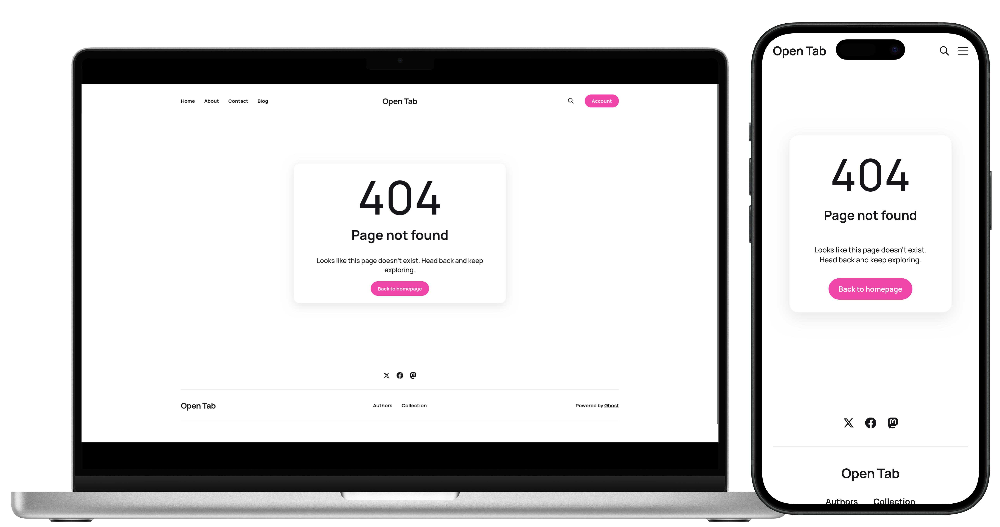
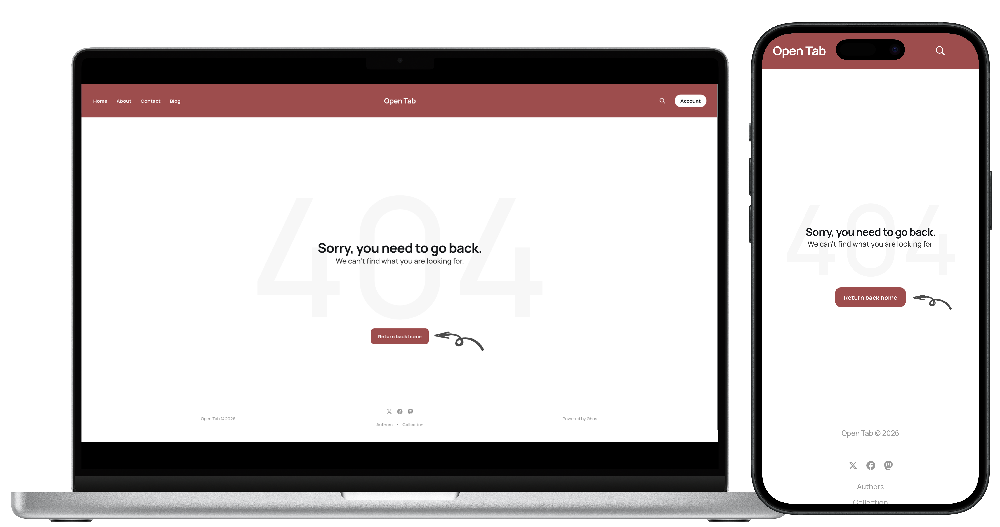
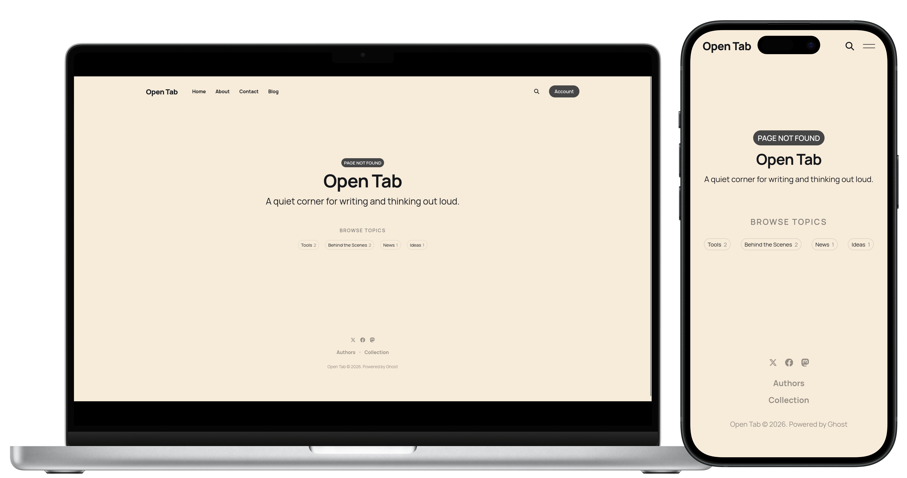

# Ghost 404 Templates

A collection of drop-in `error-404.hbs` templates for [Ghost](https://ghost.org/) themes. Each one is a single self-contained file — copy it into your theme and you're done.

---

### Template 1

A two-column layout: a hero with a highlighted heading, a short message, and "Back to homepage" / "Contact us" buttons on one side, and your three most recent articles on the other.

Uses the theme's `post-card` partial to render the posts, and the styling is tuned for **Casper**'s post cards. It's built for Casper and should work on other Casper-based themes that ship a `post-card` partial. If your theme doesn't include one, the posts block won't render — use another template instead.

---

### Template 2

A clean, centered card with a large 404, a heading, a short message, and a "Back to homepage" button.

Works with any Ghost theme.

---

### Template 3

A centered layout with a custom illustration, a short message, a "Take me home" button, and your three most recent articles below.

Uses the theme's `post-card` partial to render the posts, and the styling is tuned for **Casper**'s post cards. It's built for Casper and should work on other Casper-based themes that ship a `post-card` partial. If your theme doesn't include one, the posts block won't render — use another template instead.

---

### Template 4

A minimal, centered layout with a giant faded 404 behind the message, a "Return back home" button, and a hand-drawn arrow pointing to it.

Works with any Ghost theme.

---

### Template 5

Shows your publication's title and description, followed by your most popular tags with post counts as browsable pills.

Works with any Ghost theme.

---

## How to use

Some themes (like Casper) already include an `error-404.hbs` — in that case just open it and replace the contents directly, no need to create a duplicate file.

Otherwise, pick a template and copy its `error-404.hbs` into your theme. Two ways to do it:

**In Ghost Admin** — go to Settings → Theme, click the three dots next to your active theme and choose Edit code. Hit **+**, name the file `error-404.hbs`, and paste the template contents in.

**Locally** — add `error-404.hbs` to your theme's root folder, zip the theme, then upload it via Settings → Theme → Change theme.

To preview it, visit any URL on your site that doesn't exist.

---

## Customization

**Accent color** — all templates use `var(--ghost-accent-color)`, which Ghost sets from your publication's accent color in Admin.

**Images** — templates 3 and 4 use an asset image (`{{asset "images/404_illustration.png"}}` and `{{asset "images/arrow.svg"}}`). Drop the file into your theme's `assets/images/` folder, or swap the `src` for your own image URL. Feel free to reuse the images in these folders.

**Posts block** — templates 1 and 3 pull in your latest posts via the `{{#get}}` helper. Change `limit="3"` to show more or fewer, or remove that block entirely for a leaner page.

**Tags** — template 5 lists your tags via `{{#get}}` with `limit="10"`. Adjust the limit or the `order` to change what shows.

**Copy** — all heading and description text is plain HTML inside the `.hbs` file. Edit it directly.
